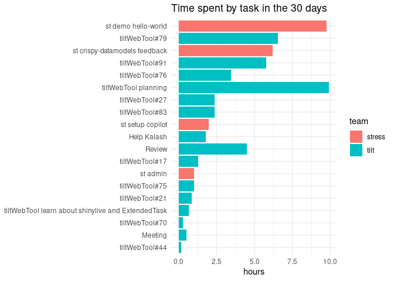
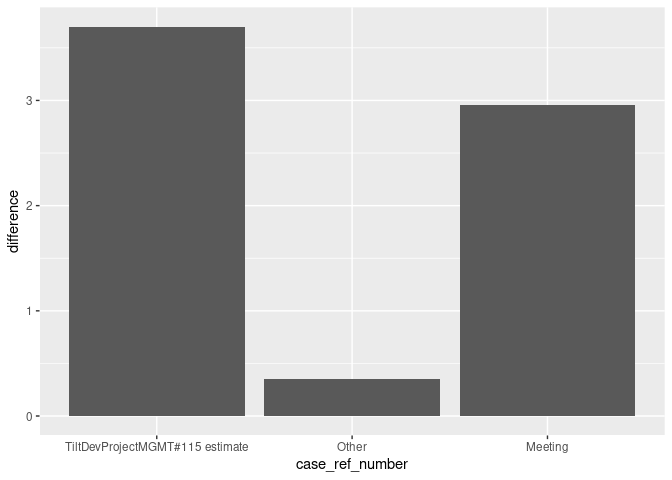

<!-- README.md is generated from README.Rmd. Please edit that file -->

# timetracker

<!-- badges: start -->

[](https://github.com/maurolepore/timetracker/actions/workflows/R-CMD-check.yaml)
<!-- badges: end -->

The goal of timetracker is to help you work with data from the
[GoogleSheets extension “Time
Tracker”](https://workspace.google.com/marketplace/app/time_tracker/182790105381).

## Installation

You can install the development version of timetracker with:

``` r
# install.packages("pak")
pak::pak("maurolepore/timetracker")
```

## Example

``` r
library(dplyr, warn.conflicts = FALSE)
library(ggplot2, warn.conflicts = FALSE)
library(googlesheets4)
library(timetracker)
```

Raw data.

``` r
url <- "https://docs.google.com/spreadsheets/d/1yz1j_CuLVwQwkzxW_6kuZH1mCEWuD-n-rCy70aORyc0/edit?usp=sharing"
raw <- read_sheet(url)
#> ℹ Suitable tokens found in the cache, associated with these emails:
#> • 'mauro@2degrees-investing.org'
#> • 'maurolepore@gmail.com'
#>   Defaulting to the first email.
#> ! Using an auto-discovered, cached token.
#>   To suppress this message, modify your code or options to clearly consent to
#>   the use of a cached token.
#>   See gargle's "Non-interactive auth" vignette for more details:
#>   <https://gargle.r-lib.org/articles/non-interactive-auth.html>
#> ℹ The googlesheets4 package is using a cached token for
#>   'mauro@2degrees-investing.org'.
#> ✔ Reading from "bit.ly/mauro-time".
#> ✔ Range 'timetracker'.
```

``` r

tail(raw)
#> # A tibble: 6 × 4
#>   `Case Ref#`    `Start Time`        `Stop Time`         Difference
#>   <chr>          <dttm>              <dttm>              <chr>     
#> 1 tiltWebTool#79 2024-06-25 11:20:07 2024-06-25 17:52:44 06:32:37  
#> 2 tiltWebTool#91 2024-06-26 04:59:05 2024-06-26 10:45:32 05:46:26  
#> 3 tiltWebTool#83 2024-06-26 10:45:33 2024-06-26 13:05:09 02:19:37  
#> 4 tiltWebTool#83 2024-06-26 13:21:43 2024-06-26 13:23:31 00:01:48  
#> 5 Help Kalash    2024-06-26 13:23:32 2024-06-26 15:11:32 01:48:00  
#> 6 <NA>           2024-06-26 15:11:34 NA                  <NA>
```

Wrangle.

``` r
time <- timetracker::wrangle(raw)

tail(time)
#> # A tibble: 6 × 5
#>   date       case_ref_number start_time          stop_time           difference 
#>   <date>     <chr>           <dttm>              <dttm>              <drtn>     
#> 1 2024-06-25 Review          2024-06-25 09:05:49 2024-06-25 11:18:17 2.20776917…
#> 2 2024-06-25 tiltWebTool#79  2024-06-25 11:20:07 2024-06-25 17:52:44 6.54360722…
#> 3 2024-06-26 tiltWebTool#91  2024-06-26 04:59:05 2024-06-26 10:45:32 5.77399333…
#> 4 2024-06-26 tiltWebTool#83  2024-06-26 10:45:33 2024-06-26 13:05:09 2.32688611…
#> 5 2024-06-26 tiltWebTool#83  2024-06-26 13:21:43 2024-06-26 13:23:31 0.02997028…
#> 6 2024-06-26 Help Kalash     2024-06-26 13:23:32 2024-06-26 15:11:32 1.79992222…
```

Last month by task.

``` r
# Time spent by task in the last week
days <- 30
time |>
  mutate(team = ifelse(grepl("^st ", case_ref_number), "stress", "tilt")) |>
  arrange(date) |> 
  slice_tail(n = days) |> 
  summarise(spent = sum(difference), .by = c("team", "case_ref_number", "date")) |> 
  ggplot(aes(x = reorder(case_ref_number, spent), y = spent)) + 
    geom_col(aes(fill = team)) +
    coord_flip() +
    labs(y = "hours") +
  theme_minimal()
#> Don't know how to automatically pick scale for object of type <difftime>.
#> Defaulting to continuous.
```



Expected vs. actual worked hours in the last Inf days.

``` r
data <- time |>
  summarise(spent = sum(difference), .by = "date") |>
  # Remove invalid
  filter(!date < 1900, spent > 0, spent < 24) |> 
  arrange(date) |> 
  slice_tail(n = as.numeric(params$days))

(.mean <- mean(data$spent))
#> Time difference of 6.277901 hours
```

``` r

# How many hours on average should I work each day of the year if I work 5 days a week, 8 hours each day, and have 30 vacation days?
weeks_in_year = 52
working_days_per_week = 5
vacation_days = 30
hours_per_day = 8
days_in_year = 365
# in a year without vacations
total_working_days = weeks_in_year * working_days_per_week
# subtracting vacations
actual_working_days = total_working_days - vacation_days
# in a year
total_working_hours = actual_working_days * hours_per_day
average_hours_per_day = total_working_hours / days_in_year

.expect <- average_hours_per_day
.actual <- mean(data$spent)

data |> 
  ggplot(aes(x = date, y = spent)) + 
    geom_col() +
    geom_hline(yintercept = .expect, color = "gray") +
    geom_hline(yintercept = .actual, color = "red") +
    scale_y_continuous(breaks = seq(0, 24, 1))
```


