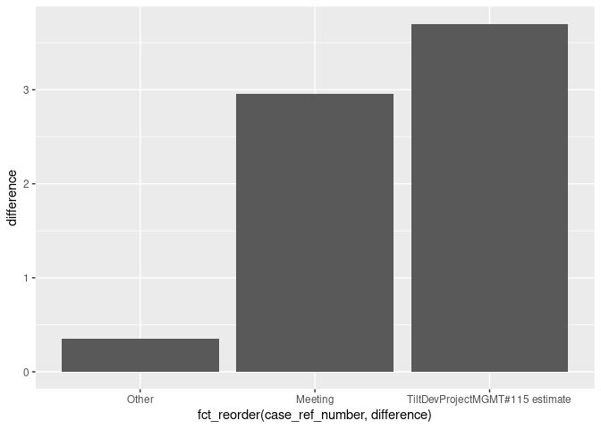

<!-- README.md is generated from README.Rmd. Please edit that file -->

# timetracker

<!-- badges: start -->
<!-- badges: end -->

The goal of timetracker is to help you work with data from the
[GoogleSheets extension “Time
Tracker”](https://workspace.google.com/marketplace/app/time_tracker/182790105381).

## Installation

You can install the development version of timetracker with:

``` r
# install.packages("pak")
pak::pak("maurolepore/timetracker")
```

## Example

``` r
library(timetracker)
library(googlesheets4)
library(dplyr, warn.conflicts = FALSE)
library(forcats)
library(ggplot2)

url <- "https://docs.google.com/spreadsheets/d/1Pz9_Dn24DPpWpEXFggSwZJWSp0DHtYbgpeS1_90KtEA/edit?usp=sharing"

time <- url |> 
  # Read your google sheet with googlesheets4
  read_sheet() |> 
  # Wrangle the data with timetracker
  timetracker::wrangle()
#> ! Using an auto-discovered, cached token.
#>   To suppress this message, modify your code or options to clearly consent to
#>   the use of a cached token.
#>   See gargle's "Non-interactive auth" vignette for more details:
#>   <https://gargle.r-lib.org/articles/non-interactive-auth.html>
#> ℹ The googlesheets4 package is using a cached token for
#>   'maurolepore@gmail.com'.
#> ✔ Reading from "time-tracker".
#> ✔ Range 'Sheet1'.
time
#> # A tibble: 21 × 5
#>    date       case_ref_number start_time          stop_time           difference
#>    <date>     <chr>           <dttm>              <dttm>              <drtn>    
#>  1 2023-07-13 Meeting         2023-07-13 05:00:00 2023-07-13 05:40:00 0.6666666…
#>  2 2023-07-13 Other           2023-07-13 05:40:00 2023-07-13 05:51:10 0.1861219…
#>  3 2023-07-13 Other           2023-07-13 05:53:23 2023-07-13 05:53:25 0.0004794…
#>  4 2023-07-13 Meeting         2023-07-13 07:31:11 2023-07-13 09:48:35 2.2900258…
#>  5 2023-07-13 Other           2023-07-13 10:04:58 2023-07-13 10:14:53 0.1652886…
#>  6 2023-07-13 TiltDevProject… 2023-07-13 10:52:17 2023-07-13 11:58:49 1.1088472…
#>  7 2023-07-13 TiltDevProject… 2023-07-13 14:00:00 2023-07-13 15:30:00 1.5000000…
#>  8 2023-07-13 TiltDevProject… 2023-07-13 16:12:42 2023-07-13 16:30:36 0.2981397…
#>  9 2023-07-14 TiltDevProject… 2023-07-14 06:07:39 2023-07-14 06:08:12 0.0091425…
#> 10 2023-07-14 TiltDevProject… 2023-07-14 06:08:14 2023-07-14 06:44:46 0.6089452…
#> # ℹ 11 more rows

# Analyze the data with familiar tidyverse packages
summary <- time |> 
  group_by(case_ref_number) |> 
  summarise(difference = sum(difference))
summary
#> # A tibble: 3 × 2
#>   case_ref_number                 difference    
#>   <chr>                           <drtn>        
#> 1 Meeting                         2.956692 hours
#> 2 Other                           0.351890 hours
#> 3 TiltDevProjectMGMT#115 estimate 3.700379 hours

summary |> 
  ggplot() + geom_col(aes(fct_reorder(case_ref_number, difference), difference))
#> Don't know how to automatically pick scale for object of type <difftime>.
#> Defaulting to continuous.
```


